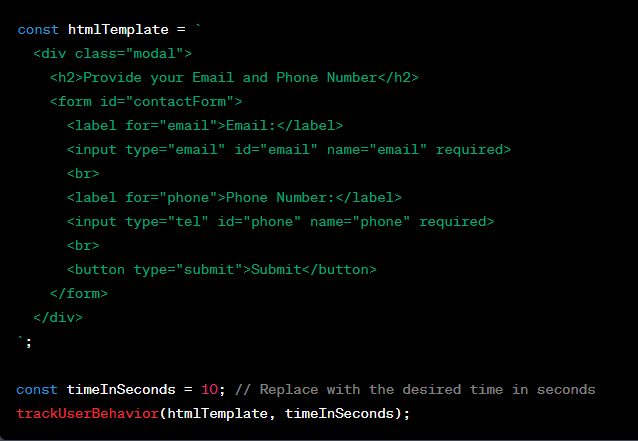

**The trackUserBehavior function takes two arguments:**

**htmlTemplate**: A string containing the HTML template for the modal.
**timeInSeconds**: The time in seconds after which the modal should appear if the user hasn't triggered it by moving the mouse upward.
The function creates a modal using the provided HTML template and attaches event listeners to track user behavior. The modal will be displayed as soon as the user moves the mouse towards the top of the page or when the specified time has passed.

The example usage at the end demonstrates how to use the trackUserBehavior function with a custom HTML template and a time of 10 seconds. You can modify the htmlTemplate and timeInSeconds variables to suit your specific needs.

# Modal Marketing Module

This npm module provides a powerful marketing tool to display modals based on specific triggers. The module allows you to create custom HTML templates for the modals and set the time (in seconds) after which the modal should appear if the user hasn't triggered it by moving the mouse upwards.

## Example Usage

The **trackUserBehavior** function takes two arguments:

1-- `htmlTemplate`: A string containing the HTML template for the modal.

2-- `timeInSeconds`: The time in seconds after which the modal should appear if the user hasn't triggered it by moving the mouse upward.

###The function creates a modal using the provided HTML template and attaches event listeners to track user behavior. The modal will be displayed as soon as the user moves the mouse towards the top of the page or when the specified time has passed.###

The example usage at the end demonstrates how to use the trackUserBehavior function with a custom HTML template and a time of 10 seconds. You can modify the **htmlTemplate** and **timeInSeconds** variables to suit your specific needs.
